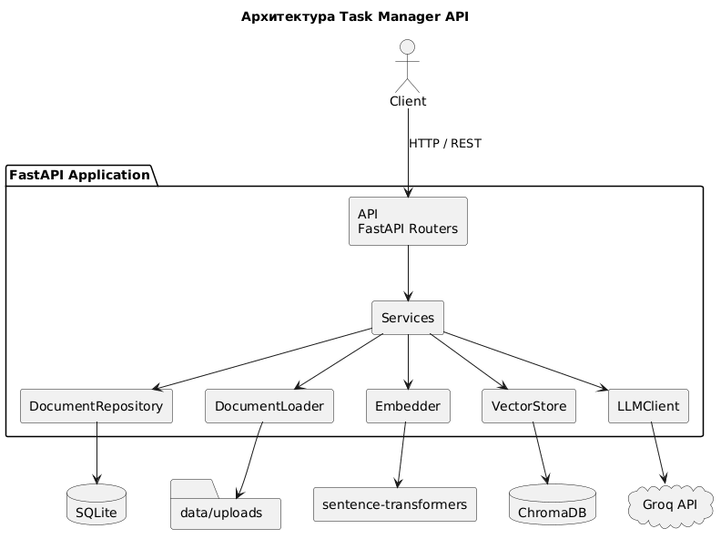
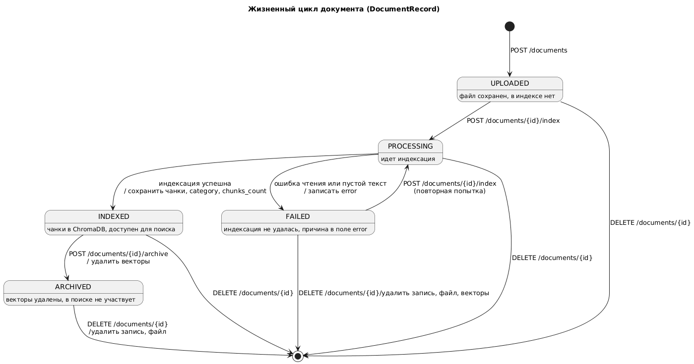

# DocMind

Бэкенд-сервис для работы с загруженными документами: семантический поиск, ответы на вопросы по содержимому (RAG), резюме и автоматическое определение темы. Все ML-компоненты расчитаны для работы на CPU.

Сервис расчитан на  получение информации из набора документов: пользователь загружает файлы, сервис индексирует их и позволяет искать фрагменты по смыслу, задавать вопросы на естественном языке и получать резюме. По сути, система представляет собой набор инструментов для дополнения языковой модели контекстом из реальных данных, что используется для точных ответов на поставленные вопросы.

## Целевые пользователи

- Студенты и исследователи (конспекты, статьи, отчеты).
- Сотрудники, работающие с внутренней документацией.
- Разработчики, подключающие поиск по документам через REST API.

## Стек

- **Язык:** Python 3.12
- **Фреймворки:** FastAPI, Uvicorn, LangChain
- **БД:** SQLite (SQLAlchemy), ChromaDB
- **ML:** sentence-transformers (`paraphrase-multilingual-MiniLM-L12-v2`), LLM (`Llama 3.1 8B`)

## Архитектура

Сервис представляет собой воплощение чистой архитектурой, с возможным внедрением зависимостей: роутеры вызывают сервисы, сервисы получают репозиторий, эмбеддер, векторное хранилище и LLM-клиент через конструктор в виде интерфейсов.



## Модули

Сервис корректно разбит на модули - модуль файлов конфигурации, 

| Модуль | Ответственность |
|---|---|
| `app/main.py` | Создание приложения, роутеры, преобразование ошибок в HTTP-коды |
| `app/api/` | HTTP-эндпоинты и схемы запросов и ответов |
| `app/core/` | Конфигурация, исключения, сборка зависимостей (DI) |
| `app/db/` | Подключение к БД, модели, статусы документа и правила переходов |
| `app/repositories/` | Доступ к данным SQLite |
| `app/services/document_service.py` | Загрузка, архивация, удаление документов |
| `app/services/indexing.py` | Индексация: чтение, чанкование, эмбеддинги, запись в ChromaDB |
| `app/services/search.py` | Семантический поиск |
| `app/services/qa.py` | Ответы на вопросы (RAG) |
| `app/services/summary.py` | Резюме документа |
| `app/services/classifier.py` | Определение темы по эмбеддингам |
| `app/services/loaders.py` | Выбор загрузчика по расширению файла |
| `app/ml/` | Интерфейсы и реализации `Embedder` и `VectorStore` |
| `app/clients/llm.py` | Интерфейс `LLMClient` и клиент Groq |

- **SQLite** (`data/docmind.db`): метаданные документов, статусы, история запросов.
- **ChromaDB** (`data/chroma`): векторы и тексты чанков.
- **Файловая система** (`data/uploads`): загруженные файлы.
- **Groq API** (HTTPS): генерация ответов и резюме.
- **Hugging Face Hub**: скачивание модели эмбеддингов при первом запуске.

## Жизненный цикл сущностей (DicymentRecord)




## Запуск

```bash
python -m venv .venv
source .venv\Scripts\activate
pip install -r requirements.txt

copy .env.example .env     # указать GROQ_API_KEY

uvicorn app.main:app --reload --port 8080
```

Swagger UI: http://127.0.0.1:8080/docs